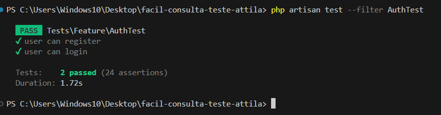

# **Facil Consulta Teste Attila API**

Olá, meu nome é **ATTILA SAMUELL TABORY**, eu amo tecnologia 👋  
[LinkedIn](https://www.linkedin.com) | [YouTube](https://www.youtube.com) | [Play Store](https://play.google.com)

## Facil Consulta Teste Attila API

Esta é a **Facil Consulta Teste Attila API**, desenvolvida por **Attila Samuell Nunes Tabory** com **PHP 8.2.13** e **Laravel 11**. Este projeto fornece endpoints para gerenciamento de consultas, médicos, pacientes e autenticação de usuários. Ele segue uma arquitetura limpa, separando responsabilidades em controladores, requisições, recursos, serviços e repositórios.

## Arquitetura e Organização do Projeto

### Estrutura de Diretórios

- **app/Http/Controllers**: Contém os principais controladores como `AuthController` para autenticação de usuários, `ConsultationController` para gerenciar consultas e `PatientController` para gerenciar pacientes.
- **app/Http/Requests**: Inclui classes de validação para as requisições de API, garantindo que os dados fornecidos pelos usuários sejam válidos antes de serem processados. Exemplo de requisições: `AddConsultationRequest`, `LoginRequest`, `UpdatePatientRequest`.
- **app/Http/Resources**: Define os recursos para formatar as respostas da API, como `ConsultationResource`, `DoctorResource` e `PatientResource`.
- **app/Repositories**: Implementa a lógica de acesso aos dados, como `ConsultationRepository`, que lida com operações de persistência de dados relacionados a consultas e pacientes.
- **app/Services**: A camada de serviço abstrai a lógica de negócios, incluindo `AuthService` para autenticação e `ConsultationService` para operações relacionadas a consultas.

### Padrões de Design Utilizados

- **Padrão Repository**: Utilizado para abstrair a lógica de acesso aos dados. Por exemplo, o `ConsultationRepository` lida com a comunicação com o banco de dados para operações relacionadas a consultas, mantendo o código da aplicação desacoplado da lógica de persistência de dados.
- **Padrão Service**: Encapsula a lógica de negócios em classes de serviço, como `AuthService` e `ConsultationService`. Esses serviços centralizam as operações complexas, tornando o código mais organizado e testável.
- **Injeção de Dependência**: Utilizada para injetar dependências (ex.: `AuthService`, `ConsultationService`) nas classes através do contêiner de serviços do Laravel, promovendo baixo acoplamento e facilitando a manutenção.
- **Padrão Singleton**: Aplicado na classe `AuthService`, garantindo que exista apenas uma instância desse serviço durante o ciclo de vida da aplicação.
- **Padrão Controller-Service-Repository**: Esse padrão ajuda a manter a separação de responsabilidades ao longo da aplicação. O controlador recebe a solicitação, o serviço processa a lógica de negócios e o repositório lida com o acesso aos dados.

## Principais Endpoints

### Autenticação (AuthController)

- **POST** `/api/login`: Realiza o login e retorna um token de acesso.
- **POST** `/api/register`: Registra um novo usuário.
- **POST** `/api/logout`: Realiza o logout do usuário autenticado.
- **GET** `/api/profile`: Retorna o perfil do usuário autenticado.
- **POST** `/api/refresh`: Atualiza o token de acesso.

### Consultas (ConsultationController)

- **POST** `/api/consultations`: Cria uma nova consulta.
- **PUT** `/api/consultations/{consultation}`: Atualiza uma consulta existente.
- **GET** `/api/consultations/{consultation_id}`: Obtém detalhes de uma consulta específica.

### Pacientes (PatientController)

- **POST** `/api/patients`: Cria um novo paciente.
- **PUT** `/api/patients/{patient_id}`: Atualiza os dados de um paciente.
- **GET** `/api/patients/{patient_id}`: Obtém detalhes de um paciente.

### Configuração Inicial

Para instalar o projeto, siga os passos abaixo:

1. **Clonar o repositório e criar o arquivo `.env`:**

   ```bash
   cp .env.example .env


2. **Instalar o Laravel Sail e iniciar os containers Docker:**

   ```bash
   ./vendor/bin/sail up -d

3. **Instalar as dependências do Composer com o Sail Or Only Composer:**

   ```bash
   composer install  OR ./vendor/bin/sail composer install

4. **Gerar a chave de aplicação:**

   ```bash
   php artisan key:generate OR ./vendor/bin/sail php artisan key:generate

5. **Executar as migrações:**

   ```bash
   php artisan migrate OR ./vendor/bin/sail php artisan migrate

5. **JWT:**

   ```bash
   php artisan jwt:secret OR ./vendor/bin/sail php artisan jwt:secret

   

### Documentação da API - SCRIBE

```bash
   ./vendor/bin/sail php artisan scribe:generate  OU php artisan scribe:generate
 

### Teste Php Unit - Module Auth


